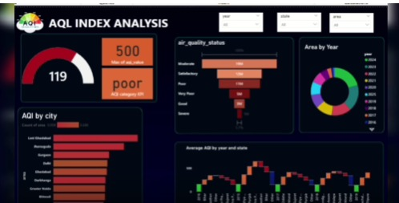

# 📊 AQI Index Analysis Dashboard

## 🚀 Project Overview
This project presents an interactive **Air Quality Index (AQI) Analysis Dashboard** built using Power BI. It helps analyze pollution levels across different cities, states, and years to support better environmental decision-making.

---

## 🎯 Objectives
- Analyze AQI levels across multiple cities  
- Identify trends in air pollution over time  
- Compare air quality across regions  
- Classify AQI into categories (Good, Moderate, Poor, etc.)

---

## 🛠️ Tools & Technologies
- Power BI  
- Excel / CSV Dataset  
- DAX (Data Analysis Expressions)  

---

## 📌 Key Features
- 📍 AQI comparison by city  
- 📅 Year-wise filtering  
- 📊 State-wise AQI distribution  
- 🎯 AQI category indicator  
- 📈 Trend analysis of AQI over time  

---
## 📷 Dashboard Preview

---

## 📊 Key Insights
- Certain cities consistently show higher AQI levels  
- AQI trends vary year by year  
- Many regions fall under "Poor" air quality category  

---

## 📂 Dataset
- Source: (Add your dataset source here)  
- Data includes:
  - City  
  - State  
  - AQI values  
  - Year  

---

## ▶️ How to Use
1. Download the `.pbix` file  
2. Open in Power BI Desktop  
3. Use filters (Year, City, State) to explore  

---

## 💡 Future Improvements
- Add real-time AQI data  
- Include predictive analytics  
- Combine weather data for deeper insights  

---

## 🤝 Contribution
Feel free to fork this repository and improve the project.

---

## ⭐ Support
If you like this project, give it a ⭐ on GitHub!
